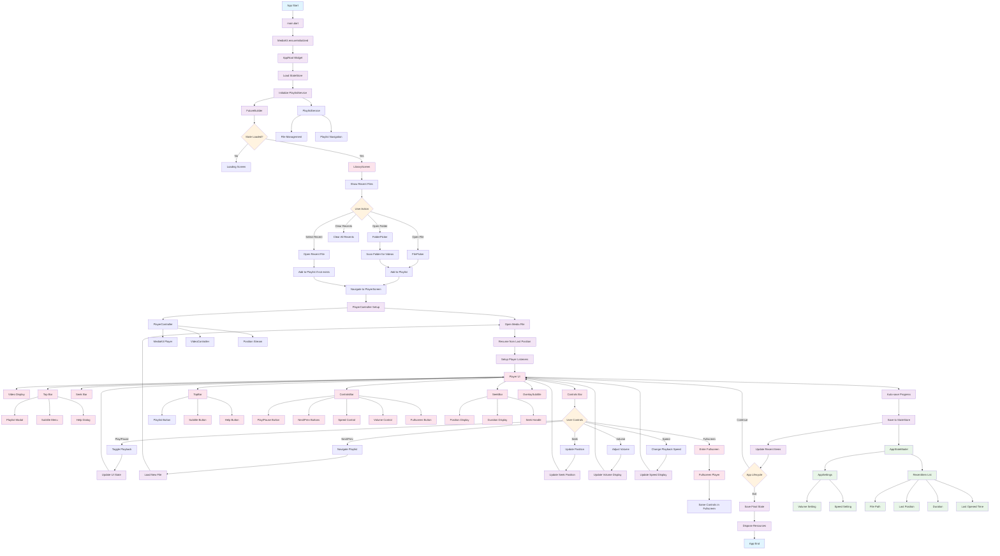

# Clean Player - Project Flow Chart

## Key Flow Points:

1. **App Initialization**: MediaKit setup → State loading → Library screen
2. **File Selection**: File/Folder picker → Playlist management → Player navigation
3. **Player Experience**: Media loading → Resume position → Real-time controls
4. **State Persistence**: Auto-save progress → Update recents → Maintain settings
5. **UI Components**: Modular design with TopBar, ControlsBar, SeekBar, and overlays

## Architecture Highlights:

- **State Management**: Centralized with AppStateModel and StateStore
- **Service Layer**: PlaylistService for file management
- **Controller Pattern**: PlayerController wraps MediaKit functionality
- **Reactive UI**: Stream-based updates for position and playback state
- **Platform Support**: Cross-platform with platform-specific optimizations
